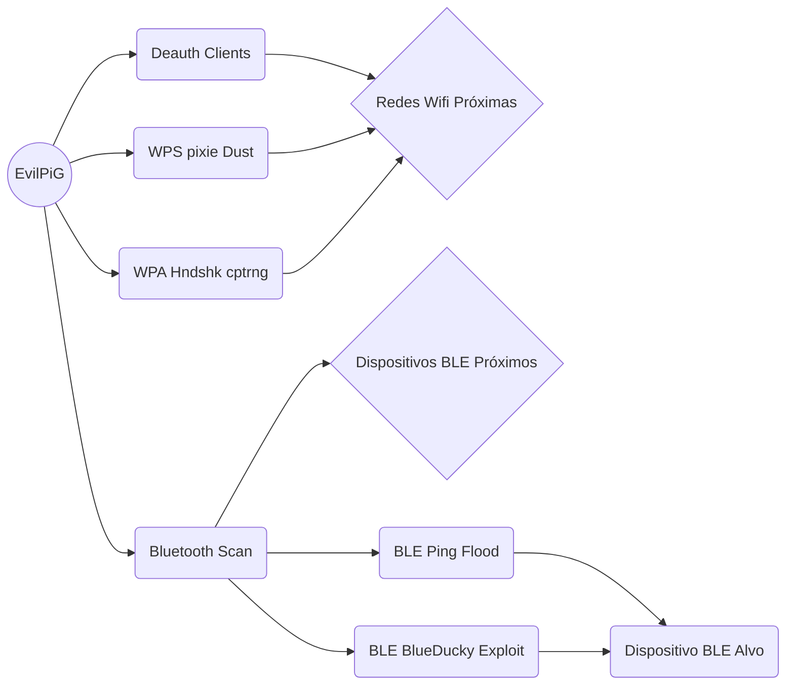

# EvilPiG - Porco Maligno
```
░▒▓████▓▒ ░▒█▓▒░░▒▓▓▒░  ░▒▓▒░▒▓▒░     ░▒▓███▓▒░░▒▓▒░░▒▓██▓▒░  
░▒▒░      ░▒▓▓▒░░▒▓▓▒░  ░▒▓▒░▒▓▒░     ░▒▓▒░░▒▓▒░▒▓▒░▒▓▒░░▒▓▒░ 
░▒▒░      ░▒▓▓▒░░▒▓▓▒░  ░▒▓▒░▒▓▒░     ░▒▓▒░░▒▓▒░▒▓▒░▒▓▒░        
░▒▓██▓▒░   ░▒▓▓▒▒▓▓▒░   ░▒▓▒░▒▓▒░     ░▒▓███▓▒░░▒▓▒░▒▓▒░▓█▓▒░ 
░▒▒░        ░▒█▓▓█▓▒    ░▒▓▒░▒▓▒░     ░▒▓▒░    ░▒▓▒░▒▓▒░░▒▓▒░ 
░▒▒░         ▒▓▓▓█▒░    ░▒▓▒░▒▓▒░     ░▒▓▒░    ░▒▓▒░▒▓▒░░▒▓▒░ 
░▒▓███▓▒░     ▒▓█▓▒     ░▒▓▒░▒▓█████▓▒░▒▓▒░    ░▒▓▒░░▒███▓▒░         

                         ...     .......                      
                  ..-+#########################+++-..         
             ..+#######################################+...#+.
 .....-####+##############################################+#++
 .-########################################################+. 
  .-########################################################. 
    .+######################################################. 
...-+######################################################+. 
###########################################################-. 
###########################################################.  
..-++####################################################+.   
     .....--+###########################################+.    
               .#######..--+++#########++-....+#########+.    
               .+#####-.                      .+###.+###+.    
               .+#++##.                        .##-..+##-.    
               .##.-#+                         .##.  -##.     
               -+..##.                        .+-.. .+#+.     
                  ....                              ...       
```

O EvilPiG (Evil Pi Gadget) é uma ferramenta versátil que utiliza originalmente um Orange Pi Zero3 sendo funcional em outros modelos de Orange Pi, Raspberry Pi, ou placas similares para realizar ataques automatizados e manuais em redes sem fio, dispositivos Bluetooth e outros sistemas conectados. O projeto permite o uso de adaptadores USB de Wi-Fi, RF e Bluetooth, oferecendo uma interface web amigável para controle e monitoramento dos ataques, acessível por meio de um celular ou notebook. Além disso, é possível acessar o dispositivo via SSH, permitindo o controle para a realização de ataquesmanuais mais complexos.

# Features

- AutoPwn WiFi com WPS Pixie Dust exploit
	> Basta selecionar a interface  wifi e clicar em iniciar o ataque
	
- AutoPwn WiFi com WPA/WPA2 HandShake Capture	
- AutoPwn WiFi com Ataque misto WPA/WPA2 HandShake Capture e WPS Pixie Dust exploit	
- WiFi Spoofing
- Exploit Bluetooth - Ping Flood de camada 2
- Exploit Bluetooth - Blueducky
- Controle e monitoramento em tempo real através de uma interface web
	> Interface web acessível via ip ou DNS na VPN independente da rede que o Porco conecte
	
- Acesso remoto via SSH para controle avançado	
- Acesso via VPN usando Tailscale com MagicDNS para acessa via hostname

Isso permite o Porco realizar ataques simultâneos utilizando quantas interfaces WiFi e Bluetooth estiverem disponíveis:



# A fazer
- Wifi Access Point com Sniffing de tráfego e DNS poisoning.
- Wifi Phishing para captura de credenciais
- Interface para ataques RF usando um RTL-SDR

# Pré-requisitos

- Antes de começar, você precisará ter instalado em seu Pi:
- Ubuntu 20.04 LTS ou posterior
- Python 3.12
- Bibliotecas necessárias: streamlit

# Instalação
```bash
cd  /opt
sudo  git  clone  https://github.com/Pasch0/EvilPiG
cd  EvilPiG
sudo  python3  setup.py
```

# Tecnologias Utilizadas

- Python
- Streamlit (para a interface web)
- Wifite
- Airmon-ng
- Aircrack-ng
- bully
- Scapy

  
# Contribuição

Contribuições são bem-vindas! Sinta-se à vontade para abrir um issue ou enviar um pull request.

# EvilPiG 

The EvilPiG (Evil Pi Gadget) is a versatile tool originally utilizing an Orange Pi Zero3 but also functional on other models of Orange Pi, Raspberry Pi, or similar boards to perform automated and manual attacks on wireless networks, Bluetooth devices, and other connected systems. The project allows the use of USB adapters for Wi-Fi, RF and Bluetooth, providing a user-friendly web interface for controlling and monitoring attacks, accessible via a smartphone or laptop. Additionally, it is possible to access the device via SSH, allowing control for executing more complex manual attacks.

## Features

- AutoPwn WiFi with WPS Pixie Dust exploit

- AutoPwn WiFi with WPA/WPA2 HandShake Capture

- AutoPwn WiFi with mixed attack WPA/WPA2 HandShake Capture and WPS Pixie Dust exploit

- WiFi Spoofing

- Bluetooth Exploit - Layer 2 Ping Flood

- Bluetooth Exploit - Blueducky

- Real-time control and monitoring through a web interface

- Remote access via SSH for advanced control

- Access via VPN using Tailscale with MagicDNS for hostname access

## Prerequisites

Before starting, you will need to have installed on your machine:

- Python 3.12

- Required libraries: streamlit

- Ubuntu 20.04 LTS or later

## Installation

```bash
cd  /opt
sudo  git  clone  https://github.com/Pasch0/EvilPiG
cd  EvilPiG
sudo  python3  setup.py
```